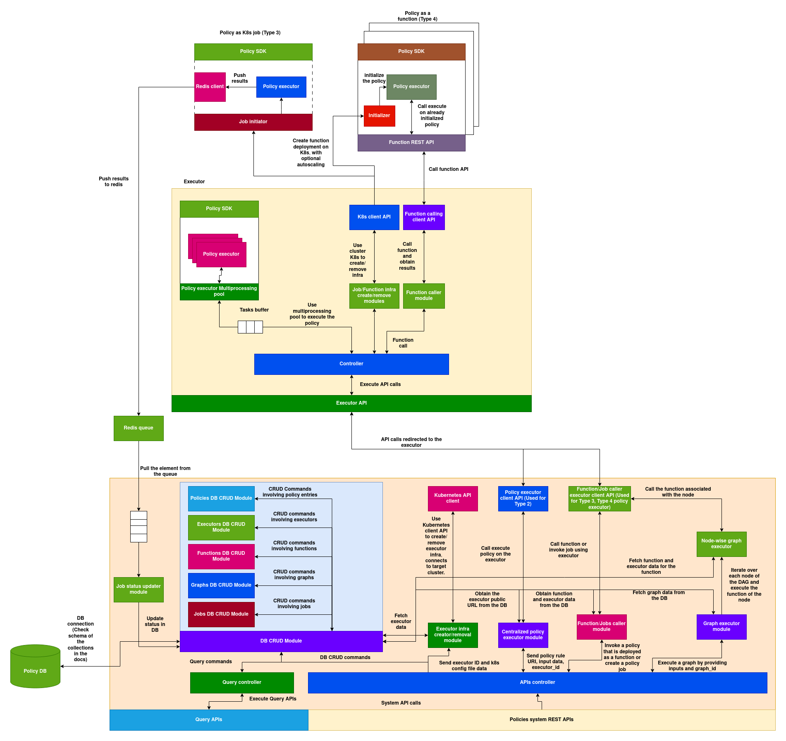

# Policies:

## What is a policy?
A policy is a dynamically loadable, executable Python code that is used in various places and use cases across the AIOS system. Since policies are dynamic, they allow developers to implement custom functionalities throughout the AIOS system. Below are some examples of polices used in AIOS:

**1. Auto-scaler Policy in Block:** Enables developers to build custom autoscaling mechanisms for upscaling or downscaling the instances of a block based on demand.

**2. Load Balancer Policy in Block:** Allows developers to create custom load-balancing strategies tailored to their specific block requirements.

**3. Template Parser Policy in Parser:** Enables developers to define custom, user-friendly specifications for vDAGs, blocks, and other components in their network, instead of relying solely on the default specification.

**etc.**
 
Policies are used in many components and for various purposes. Overall, they enable developers to implement custom functionality on top of the existing system wherever customization is supported. This flexibility makes AIOS a general-purpose platform that does not impose rigid constraints, empowering developers to make decisions as needed.

## System Architecture:




## Structure of a policy:

Policy is a dynamically loadable python class, here is the structure of a policy class:

```python
class AIOSv1PolicyRule:
    def __init__(self, rule_id, settings, parameters):
        """
        Initializes an AIOSv1PolicyRule instance.

        Args:
            rule_id (str): Unique identifier for the rule.
            settings (dict): Configuration settings for the rule.
            parameters (dict): Parameters defining the rule's behavior.
        """
        self.rule_id = rule_id
        self.settings = settings
        self.parameters = parameters

    def eval(self, parameters, input_data, context):
        """
        Evaluates the policy rule.

        Args:
            parameters (dict): The current parameters.
            input_data (any): The input data to be evaluated.
            context (dict): Context (external cache), this can be used for storing and accessing the state across multiple runs.

        Returns:
            dict: A dictionary with the evaluation result.
        """
        # Rule logic goes here (can modify input_data)
        return {}

    def management(self, action: str, data: dict) -> dict:
        """
        Executes a custom management command.

        This method enables external interaction with the rule instance for purposes such as:
        - updating settings or parameters
        - fetching internal state
        - diagnostics or lifecycle control

        Args:
            action (str): The management action to execute.
            data (dict): Input payload or command arguments.

        Returns:
            dict: A result dictionary containing the status and any relevant details.
        """
        # Implement custom management actions here
        pass

```

## Types of Policy Execution

Policies can be executed in five different ways across the AIOS system.

### 1. Type 1: Policy loaded and executed as part of another AIOS application inside its own process space

Any service that implements and uses the Local Policy Evaluation SDK can download the policy code and execute it locally to extend its own functionality. These policies can be stateful or stateless depending on how the application uses them. Refer to the Local Policy Evaluation Guide to understand how to load and execute a policy locally within the application space.

**Characteristics**:

1. **Policy Lifecycle**: Completely dependent on the application. The application can load and terminate the policy at any time.
2. **Communication**: Communication between the policy and the application happens through in-process memory.
3. **Scaling**: Scaling is not handled implicitly. The application decides when to create another process/thread as per its own requirements.
4. **Fault Tolerance**: Depends on the fault tolerance of the application.

### 2. Type 2: Policies executed by the central policy executor

Applications can tap into the online policy executors to execute policies and fetch results using the **Policy System APIs**. In this case, the policy is executed by the policy executor with its own memory and resources, which the application does not need to provide. Developers can also deploy their own policy executor on a remote machine and use it with their application (refer to the Policy System Guide for more details).

**Important**: Type 2 policy execution mode can only be used for stateless policies. Refer to Type 4 for stateful remote policy deployments.

**Characteristics**:

1. **Policy Lifecycle**: Stateless. The policy is loaded into the executor's memory and evicted once execution is complete.
2. **Communication**: Communication between the policy and the application happens through a REST API over HTTP. Execution is handled by the executor.
3. **Scaling**: Not handled implicitly. The executor can scale its instances based on load.
4. **Fault Tolerance**: Depends on the fault tolerance of the executor.

### 3. Type 3: Policies deployed on remote clusters as jobs

Policies can be deployed as jobs on a remote cluster that has a registered policy executor. This type is useful for scenarios where you want to run a resource-heavy policy one-time on a remote node, without persistence. It can also be used to gather data about the remote cluster—such as metrics, available resources, or node health.

**Important**: Type 3 policy execution is stateless; its lifecycle begins and ends as a one-time job.

**Characteristics**:

1. **Policy Lifecycle**: Stateless. The policy runs as a Kubernetes Job and is terminated by Kubernetes upon completion.
2. **Communication**: The application cannot communicate with the policy during execution—it can only wait for the results.
3. **Scaling**: Not applicable.
4. **Fault Tolerance**: Handled by Kubernetes.

### 4. Type 4: Policies deployed as stateful online functions

Policies can be deployed as stateful functions that expose their services via the Policy System Service (refer to the Policy System section below). These functions can be invoked via REST API.

**Characteristics**:

1. **Policy Lifecycle**: Stateful. Initialized once after function deployment and runs as a pod on Kubernetes.
2. **Communication**: Communication between the policy and the application happens through a REST API over HTTP.
3. **Scaling**: Autoscaling rules can be set at the time of function creation.
4. **Fault Tolerance**: Handled by Kubernetes.


### 5. Type 5: Policies as a graph

Static DAGs (Directed Acyclic Graphs) can be defined over policies deployed as Type 4 functions. Each node in the DAG is a policy function. These graphs are pre-defined, stored in a registry, and can be searched and executed using a graph ID.

**Characteristics**:

1. **Policy Lifecycle**: Nodes in the graph are stateful and inherit the same properties as Type 4 policies.
2. **Communication**: Communication between graph nodes is orchestrated by the Policy System (refer to Policy System APIs).
3. **Scaling**: Nodes can be individually scaled, as each one is a Type 4 policy function.
4. **Fault Tolerance**: Handled by Kubernetes.

Here's a table summarizing the five types of policy execution across the AIOS system:

| **Type** | **Description** | **Policy Lifecycle** | **Communication** | **Scaling** | **Fault Tolerance** |
|---------|------------------|----------------------|-------------------|--------------|----------------------|
| **Type 1**<br>Policy loaded and executed inside an AIOS application | Executed within the application's own process using the Local Policy Evaluation SDK | Managed by the application; can be loaded/unloaded anytime | In-process memory | Handled by the application (manual process/thread management) | Depends on the application |
| **Type 2**<br>Policy executed by the central policy executor | Stateless policies executed via centralized policy executors using Policy System APIs | Stateless; loaded into memory and evicted after execution | REST API over HTTP | Executors can scale based on load (not implicit) | Depends on the executor |
| **Type 3**<br>Policy deployed as a job on remote clusters | One-time stateless policy execution on a remote Kubernetes cluster | Stateless; runs as a Kubernetes Job and terminates upon completion | No live communication; application waits for results | Not applicable | Handled by Kubernetes |
| **Type 4**<br>Policy deployed as a stateful online function | Stateful policies running as long-lived Kubernetes pods, exposed via REST API | Stateful; initialized once and runs as a pod | REST API over HTTP | Autoscaling rules configurable at deployment | Handled by Kubernetes |
| **Type 5**<br>Policies as a graph (DAG) of Type 4 functions | DAG of stateful Type 4 policies orchestrated by the policy system | Stateful; each node inherits Type 4 lifecycle | Orchestrated by the Policy System | Each node can scale independently | Handled by Kubernetes |

---

# Policies System:

Policies system constitutes various systems, databases and services responsible for archiving the end to end functionality of all the 5 types of policy execution and the applications built to provide onboarding, discovery of policies and executors.

## Schema of the structures used in Policies system:

### PolicyRule:

This schema represents a basic policy unit:

```python
@dataclass
class PolicyRule:
    policy_rule_uri: str
    name: str
    version: str
    release_tag: str
    metadata: Dict
    tags: str
    code: str
    type: str
    policy_input_schema: Dict
    policy_output_schema: Dict
    policy_settings_schema: Dict
    policy_parameters_schema: Dict
    policy_settings: Dict
    policy_parameters: Dict
    management_commands_schema: list
    description: str
```
Here’s a detailed explanation of each field in the `PolicyRule` data class, based on its usage in `from_dict()` and `to_dict()`:

---

#### Field-wise Explanation:

1. **`policy_rule_uri: str`**  
   - A unique identifier for the policy rule.
   - Constructed as: `"{name}:{version}-{release_tag}"`, e.g., `"access_control:1.0-beta"`.
   - Used to identify a specific version and release of the policy.

2. **`name: str`**  
   - The name of the policy.
   - Acts as the base identifier for the policy.

3. **`version: str`**  
   - The version of the policy (e.g., `"1.0"`, `"2.3"`).
   - Helps in versioning and maintaining backward compatibility.

4. **`release_tag: str`**  
   - A tag indicating the release status of the policy (e.g., `"beta"`, `"stable"`).
   - Used in combination with version to indicate the policy's development stage.

5. **`metadata: Dict`**  
   - Arbitrary metadata related to the policy.
   - Could include author info, creation timestamps, changelogs, etc.

6. **`tags: str`**  
   - A string containing tags associated with the policy.
   - Useful for categorization, filtering, or searching.

7. **`code: str`**  
   - The actual source code of the policy as a string.
   - This code will be executed as part of the policy logic.

8. **`type: str`**  
   - Meta-information about .
   - Corresponds to one of the policy execution types defined earlier.

9. **`policy_input_schema: Dict`**  
   - JSON schema defining the structure of valid input data for the policy.
   - Ensures the policy receives the expected data format.

10. **`policy_output_schema: Dict`**  
   - JSON schema defining the structure of the expected output from the policy.
   - Useful for validating policy output.

11. **`policy_settings_schema: Dict`**  
   - JSON schema for validating the structure of the settings specific to the policy.
   - Ensures configurable settings adhere to expected formats.

12. **`policy_parameters_schema: Dict`**  
   - JSON schema for validating the structure of runtime parameters.
   - Helps ensure correctness and completeness of runtime data.

13. **`policy_settings: Dict`**  
   - Actual settings provided to the policy at configuration time.
   - These can include toggles, thresholds, or default values.

14. **`policy_parameters: Dict`**  
   - Actual runtime parameters provided during policy invocation.
   - Can include request-specific data, user context, etc.

15. **`management_commands_schema`**
   - List of management commands supported and their schemas.
   - Useful for understanding the management commands implemented by the system.

16. **`description: str`**  
   - A human-readable description of the policy.
   - Useful for documentation, display in UI, and user understanding.

---

### PolicyExecutors:

PolicyExecutors represents a remote policy executor that is deployed and registered by a developer on his/her own machine/cluster.

```python
@dataclass
class PolicyExecutors:
    executor_id: str
    executor_host_uri: str
    executor_metadata: Dict
    executor_hardware_info: Dict
    executor_status: str = field(default="healthy")
```

Here’s a field-by-field explanation for the `PolicyExecutors` data class based on its structure and methods:

---

#### Field-wise Explanation:

1. **`executor_id: str`**  
   - A unique identifier for the policy executor.  
   - Typically used to distinguish between multiple executor instances in the system.

2. **`executor_host_uri: str`**  
   - The URI or address (e.g., IP + port or DNS) where the executor service is hosted.  
   - Applications or services will use this URI to send requests to the executor.

3. **`executor_metadata: Dict`**  
   - Arbitrary metadata associated with the executor.  
   - Can include custom tags, descriptions, labels, version info, or deployment details.

4. **`executor_hardware_info: Dict`**  
   - Contains information about the hardware environment of the executor.  
   - Includes the hardware information of the cluster/machine the executor is deployed.

5. **`executor_status: str = field(default="healthy")`**  
   - Indicates the current health or status of the executor (e.g., `"healthy"`, `"unreachable"`, `"busy"`).  
   - Defaults to `"healthy"` if not specified.  
   - Helps in monitoring and orchestrating executions across available executors.

### Function:
Functions are used to represent the Type 4 running instances of policies .

```python
@dataclass
class Function:
    function_id: str
    function_executor_id: str
    function_executor_uri: str
    function_metadata: Dict
    function_tags: List[str]
    function_policy_rule_uri: str
    function_policy_data: Dict
```

#### Field-wise Explanation:

1. **`function_id: str`**  
   - A unique identifier for the deployed policy function.  
   - Used to reference, manage, and invoke the function.

2. **`function_executor_id: str`**  
   - The ID of the policy executor responsible for running this function.  
   - This should correspond to an existing `PolicyExecutors.executor_id`.

3. **`function_executor_uri: str`**  
   - The URI of the executor where the function is deployed and accessible.  
   - Used by the system to route function execution requests.

4. **`function_metadata: Dict`**  
   - Arbitrary metadata related to the function.  
   - Can include deployment time, version, creator info, config flags, etc.

5. **`function_tags: List[str]`**  
   - A list of tags associated with the function.  
   - Useful for categorization, searching, and filtering.

6. **`function_policy_rule_uri: str`**  
   - The unique URI of the policy rule this function is based on.  
   - Should match a `PolicyRule.policy_rule_uri` and helps trace the function to its source policy logic.

7. **`function_policy_data: Dict`**  
   - A full snapshot or reference data of the policy rule used in the function.  
   - May include input/output schemas, settings, parameters, or a copy of the policy metadata.

### Graph:

Graph represents the Type 5 policy rule

```python
@dataclass
class Graph:
    graph_uri: str
    graph_name: str
    graph_version: str
    graph_release_tag: str
    graph_metadata: str
    graph_function_ids: List[str]
    graph_connection_data: Dict
    graph_search_tags: List[str]
    graph_description: str
    graph_input_schema: Dict
    graph_output_schema: Dict

```

#### Field-wise Explanation:

1. **`graph_uri: str`**  
   - A unique identifier for the graph.  
   - Constructed as: `"{graph_name}:{graph_version}-{graph_release_tag}"`.  
   - Used to uniquely identify the versioned graph.

2. **`graph_name: str`**  
   - The human-readable name of the graph.  
   - Represents the identity or purpose of the graph (e.g., `"fraud-detection-graph"`).

3. **`graph_version: str`**  
   - The version of the graph.  
   - Used for versioning and backward compatibility.

4. **`graph_release_tag: str`**  
   - A release tag indicating the status of the graph (e.g., `"beta"`, `"prod"`).  
   - Helps in managing staged releases.

5. **`graph_metadata: str`**  
   - Arbitrary metadata for the graph, stored as a string (could be JSON-encoded).  
   - May include author info, creation date, update notes, etc.

6. **`graph_function_ids: List[str]`**  
   - A list of function IDs (from the `Function` class) that are part of the graph.  
   - Each function represents a node in the DAG.

7. **`graph_connection_data: Dict`**  
   - Defines how the functions are connected within the graph (i.e., the edges of the DAG).  
   - Likely a mapping of function IDs to their downstream function dependencies.

8. **`graph_search_tags: List[str]`**  
   - Tags used to categorize and search for graphs.  
   - Useful for filtering in registries or UIs.

9. **`graph_description: str`**  
   - A human-readable description of the graph.  
   - Explains its intent, functionality, or use cases.

10. **`graph_input_schema: Dict`**  
    - JSON schema defining the structure of the input data accepted by the graph.  
    - Ensures input validation at execution time.

11. **`graph_output_schema: Dict`**  
    - JSON schema defining the expected structure of the output from the graph.  
    - Useful for validation and interoperability.

## Preparing Policy for onboarding:

**Step 1: Create a Policy:**

As explained in the introduction, policy is a python class which can be loaded and executed dynamically, here is a sample policy:

This sample simulates a policy that checks if an IP address is allowed based on a list fetched from an external API (using requests). It also supports management actions to update the allowlist or fetch current state.

```python
import requests
import logging

class AIOSv1PolicyRule:
    def __init__(self, rule_id, settings, parameters):
        """
        settings = {
            "allowlist_api": "https://example.com/api/allowlist"
        }
        parameters = {
            "local_allowlist": ["127.0.0.1"]
        }
        """
        self.allowlist_cache = []
        self.settings = settings
        self.parameters = parameters

    def fetch_remote_allowlist(self):
        try:
            response = requests.get(self.settings["allowlist_api"])
            response.raise_for_status()
            data = response.json()
            return data.get("allowlist", [])
        except Exception as e:
            logging.error(f"Failed to fetch remote allowlist: {e}")
            return []

    def eval(self, parameters, input_data, context):
        ip = input_data.get("ip")
        if not ip:
            return {"allowed": False, "reason": "IP missing in input_data", "input_data": input_data}

        # Merge local + remote allowlists
        local = parameters.get("local_allowlist", [])
        if not self.allowlist_cache:
            self.allowlist_cache = self.fetch_remote_allowlist()

        full_allowlist = set(local + self.allowlist_cache)

        allowed = ip in full_allowlist
        return {
            "allowed": allowed,
            "input_data": input_data,
            "reason": "allowed" if allowed else "denied"
        }

    def management(self, action: str, data: dict) -> dict:
        if action == "update_local_allowlist":
            new_ips = data.get("ips", [])
            if not isinstance(new_ips, list):
                return {"status": "error", "message": "Expected 'ips' to be a list"}
            self.parameters["local_allowlist"] = new_ips
            return {"status": "success", "updated_allowlist": new_ips}

        elif action == "fetch_remote_allowlist":
            fetched = self.fetch_remote_allowlist()
            self.allowlist_cache = fetched
            return {"status": "success", "remote_allowlist": fetched}

        elif action == "get_state":
            return {
                "status": "success",
                "local_allowlist": self.parameters.get("local_allowlist", []),
                "cached_remote_allowlist": self.allowlist_cache
            }

        else:
            return {"status": "error", "message": f"Unknown action '{action}'"}

```

requirements.txt - use this if the third party libraries are used:
```
logging
requests
```

**2. Organize the policy code:**

Follow the structure below to organize the policy code:
```
.
-- code
    -- function.py
    -- requirements.txt
```

The file which contains `AIOSv1PolicyRule` must be named `function.py`

**3. Create a tar.xz or .zip archive of the `code` directory:**
```
zip -r ip-allow-list-checker.zip code/
```

**4. Upload the code to assets registry (optional - can use any static content server with public URL)**

If you are using assets registry:
```sh
curl -X POST http://<server-url>/upload_asset \
     -H "Content-Type: multipart/form-data" \
     -F "asset=@./ip-allow-list-checker.zip" \
     -F 'asset_metadata={
           "asset_name": "IP-allow-list",
           "asset_version": { "version": "1.0", "tag": "beta" },
           "asset_metadata": { "description": "IP allow list policy code" },
           "asset_tags": ["policy", "example"]
         }'
```

The API should return a public URL of the policy code if successful.

**5. Create the policy DB entry:

Here is the DB entry of the policy which can be on-boarded into the DB:

For the structure of templates used in `policy_input_schema`, `policy_output_schema`, `policy_settings_schema`, `policy_parameters_schema` and `management_commands_schema` - refer to the **Templates** section.

```json
{
    "name": "ip_allowlist",
    "version": "1.0",
    "release_tag": "beta",
    "metadata": {
      "author_name": "Prasanna",
      "author_email": "openvision.ai",
      "organization": "openvision.ai",
      "country": "US",
      "license": "MIT",
      "category": "network_access_control",
      "use_case": "Control access to internal systems by validating request IPs against a dynamic and local allowlist.",
      "geographic_scope": "Global",
      "audience": ["network_admins", "security_teams"],
      "integration_notes": "Ensure the allowlist API returns a JSON object with a top-level 'allowlist' key containing a list of IPs. ",
      "tested_environments": ["Ubuntu 22.04", "Amazon Linux 2"],
      "execution_environment": "Python 3.10+",
      "compliance_tags": ["ISO27001", "SOC2"]
   },
    "tags": "network,security,ip,access,allowlist",
    "code": "https://example.com/code/ip_allowlist_policy.zip",
    "type": "python_class_v1",
    "policy_input_schema": {
        "ip": {
            "type": "string",
            "description": "IP address of the incoming request",
            "pattern": "^\\d{1,3}(\\.\\d{1,3}){3}$"
        }
    },
    "policy_output_schema": {
        "allowed": {
            "type": "boolean",
            "description": "Whether access is allowed"
        },
        "input_data": {
            "type": "any",
            "description": "Original input data"
        },
        "reason": {
            "type": "string",
            "description": "Reason for the decision"
        }
    },
    "policy_settings_schema": {
        "allowlist_api": {
            "type": "string",
            "description": "HTTP API endpoint that returns a JSON allowlist",
            "pattern": "^https?://.*"
        }
    },
    "policy_parameters_schema": {
        "local_allowlist": {
            "type": "array",
            "description": "List of IPs locally allowed",
            "max_length": 100,
            "items": {
                "type": "string",
                "pattern": "^\\d{1,3}(\\.\\d{1,3}){3}$"
            }
        }
    },
    "policy_settings": {
        "allowlist_api": "https://example.com/api/allowlist"
    },
    "policy_parameters": {
        "local_allowlist": ["127.0.0.1", "192.168.0.1"]
    },
    "management_commands_schema": [
        {
            "name": "update_local_allowlist",
            "description": "Replace the local allowlist with a new set of IPs",
            "schema": {
                "ips": {
                    "type": "array",
                    "items": {"type": "string", "pattern": "^\\d{1,3}(\\.\\d{1,3}){3}$"}
                }
            }
        },
        {
            "name": "fetch_remote_allowlist",
            "description": "Refresh the allowlist from the configured remote API",
            "schema": {}
        },
        {
            "name": "get_state",
            "description": "Return current local and cached remote allowlist",
            "schema": {}
        }
    ],
    "description": "Policy that checks whether a given IP is allowed based on a local list and a remote allowlist API."
}
```

Now use the policies system API to onboard the policy:

```
curl -X POST -H "Content-Type: application/json" -d @./data.json http://<policies-system-url>/policy
```

`policy_rule_uri` will be:
```
ip_allowlist:1.0-beta
```

In general, `policy_rule_uri` will be inferred from `name`, `version` and `release_tag` fields:
```
{name}:{version}-{release_tag}
```

## Using the policy:

Once the policy is on-boarded, it can be loaded and executed using the `aios_policy_sandbox` python library.

Here is an example, go to the `services/policies_system/policies_local_sdk` from project root and build the python package:

```
pip3 install -e .
```

Now you can import and use the `aios_policy_sandbox` to execute the code locally:

```python
from aios_policy_sandbox import LocalPolicyEvaluator

settings={} # override the settings if needed
parameters={} # override the parameters if needed

policy_rule_uri="ip_allowlist:1.0-beta"

executor = LocalPolicyEvaluator(
    policy_rule_uri=policy_rule_uri,
    parameters=parameters,
    settings=settings,
    mode="local"
)

output = executor.execute_policy_rule({
   "ip": "192.168.0.109"
})

print(output)

```

To execute the code using a remote executor:

```python
from aios_policy_sandbox import LocalPolicyEvaluator

settings={} # override the settings if needed
parameters={} # override the parameters if needed

policy_rule_uri="ip_allowlist:1.0-beta"

executor = LocalPolicyEvaluator(
    policy_rule_uri=policy_rule_uri,
    parameters=parameters,
    settings=settings,
    mode="remote",
    executor_id="executor-123"
)

output = executor.execute_policy_rule({
   "ip": "192.168.0.109"
})

print(output)
```

Execute the management command:
```python
output = executor.execute_mgmt_command("update_local_allowlist", {
   "ips": ["192.168.0.100", "192.168.0.102"]
})

print(output)
```
---

## Policy system APIs:

### Policy Rule CURD APIs:

#### **1. Create a Policy**
**POST** `/policy`  
**Description:** Creates a new policy rule by passing the full `PolicyRule` JSON.

```bash
curl -X POST http://<policy-system-url>/policy \
  -H "Content-Type: application/json" \
  -d @policy.json
```
> `policy.json` should contain the full `PolicyRule` object.


####  **2. Read/Get a Policy**
**GET** `/policy/<policy_rule_uri>`  
**Description:** Retrieves a policy by its unique `policy_rule_uri`.

```bash
curl http://<policy-system-url>/policy/ip_allowlist:1.0-beta
```

---

#### **3. Update a Policy**
**PUT** `/policy/<policy_rule_uri>`  
**Description:** Updates an existing policy. The payload must contain the full updated policy.

- Accepts Mongo-style content in the body (though full policy replacement is expected).

```bash
curl -X PUT http://<server-url>:5000/policy/ip_allowlist:1.0-beta \
  -H "Content-Type: application/json" \
  -d '{
    "$set": {
      "policy_parameters.local_allowlist": ["10.0.0.1", "8.8.8.8"],
      "description": "Updated policy to allow new internal IP ranges."
    }
  }'
```


#### **4. Delete a Policy**
**DELETE** `/policy/<policy_rule_uri>`  
**Description:** Deletes the policy associated with the given `policy_rule_uri`.

```bash
curl -X DELETE http://<policy-system-url>/policy/ip_allowlist:1.0-beta
```

#### **5. Query Policies**
**POST** `/policy/query`  
**Description:** Performs a query using MongoDB-style filters to search for matching policies.

```bash
curl -X POST http://<server-url>:5000/policy/query \
  -H "Content-Type: application/json" \
  -d '{
    "release_tag": "beta",
    "tags": { "$regex": "security" },
    "version": { "$gte": "1.0" }
  }'
```

> You can use Mongo-style filters like `$regex`, `$in`, `$gt`, etc.

---

### Executor APIs (Type 2 policy execution):
Any developer or user can set up their own executor and register it in the policies system to make it available for use by applications and other users.

Refer to the Infra setup notes to learn how to set up an executor.

Here is a JSON document representing a sample executor registration payload (all the memory units are in `MB`):

```json
{
  "executor_id": "executor-001",
  "executor_metadata": {
    "author_name": "Prasanna",
    "author_email": "openvision.ai",
    "organization": "openvision.ai",
    "country": "US",
    "tags": ["amd_64", "kubernetes-cluster", "NIC"],
    "description": "My executor deployed on kubernetes"
  },
  "executor_hardware_info": {
    "nodes": {
      "count": 2,
      "nodeData": [
        {
          "id": "node-001",
          "vcpus": {
            "count": 12
          },
          "memory": 32005,
          "swap": 975,
          "storage": {
            "disks": 53,
            "size": 488742
          },
          "network": {
            "interfaces": 10,
            "txBandwidth": 0,
            "rxBandwidth": 0
          }
        },
        {
          "id": "node-002",
          "vcpus": {
            "count": 12
          },
          "memory": 32005,
          "swap": 975,
          "storage": {
            "disks": 53,
            "size": 488742
          },
          "network": {
            "interfaces": 10,
            "txBandwidth": 0,
            "rxBandwidth": 0
          }
        }
      ]
    },
    "vcpus": {
      "count": 24
    },
    "memory": 64010,
    "swap": 1950,
    "storage": {
      "disks": 106,
      "size": 977484
    },
    "network": {
      "interfaces": 20,
      "txBandwidth": 0,
      "rxBandwidth": 0
    },
    "id": "cluster-123"
  },
}
```

#### 1. **Create Executor**
**Endpoint:** `POST /executor`  
**Description:** Creates a new executor using the provided payload. The payload must follow the `PolicyExecutors` schema.

```bash
curl -X POST http://<policy-system-url>/executor \
  -H "Content-Type: application/json" \
  -d @executor.json
```

####  **Read Executor**
**Endpoint:** `GET /executor/<executor_id>`  
**Description:** Retrieves executor details for a specific `executor_id`.

```bash
curl http://<policy-system-url>/executor/executor-001
```

####  **Update Executor**
**Endpoint:** `PUT /executor/<executor_id>`  
**Description:** Updates an existing executor. The payload must contain the full updated executor object.

```bash
curl -X PUT http://<policy-system-url>/executor/executor-001 \
  -H "Content-Type: application/json" \
  -d {
    "$set": {
      "metadata.tags": ["amd_64", "zero-downtime", "ai-worker"],
      "metadata.description": "Updated policy to allow new internal IP ranges."
    }
  }
```

#### 4. **Delete Executor**
**Endpoint:** `DELETE /executor/<executor_id>`  
**Description:** Deletes the executor associated with the given `executor_id`.

```bash
curl -X DELETE http://<policy-system-url>/executor/executor-001
```

#### 5. **Query Executors**
**Endpoint:** `POST /executor/query`  
**Description:** Queries executors using MongoDB-style filter criteria.

```bash
curl -X POST http://<server-url>:5000/executor/query \
  -H "Content-Type: application/json" \
  -d '{
        "executor_metadata.tags": { "$in": ["kubernetes-cluster"] },
        "executor_hardware_info.vcpus.count": { "$gte": 16 }
      }'
```

> This will find executors tagged as `kubernetes-cluster` with 16 or more total vCPUs.


#### **Execute Policy on Executor**
**Endpoint:** `POST /executor/<executor_id>/execute_policy`  
**Description:** Executes a policy on the specified executor. You must provide the `policy_rule_uri`, `input_data`, and optional `parameters`. The request is proxied to the executor.

```bash
curl -X POST http://<policy-system-url>/executor/executor-001/execute_policy \
  -H "Content-Type: application/json" \
  -d '{
    "policy_rule_uri": "ip_allowlist:1.0-beta",
    "input_data": {
      "ip": "10.0.0.1"
    },
    "parameters": {
      "local_allowlist": ["10.0.0.1"]
    }
  }'
```

#### **Create Executor Infrastructure**
**Endpoint:** `POST /executor/<executor_id>/create-infra`  
**Description:** Provisions infrastructure for the executor on kubernetes on the target cluster. `cluster_config` includes the JSON data of the kubernetes `config` file of the target cluster.

```bash
curl -X POST http://<policy-system-url>/executor/executor-001/create-infra \
  -H "Content-Type: application/json" \
  -d '{
    "cluster_config": <json-data of the kubeconfig file>
  }'
```

#### **Remove Executor Infrastructure**
**Endpoint:** `DELETE /executor/<executor_id>/remove-infra`  
**Description:** Decommissions or tears down the infrastructure associated with the executor on the target cluster. `cluster_config` includes the JSON data of the kubernetes `config` file of the target cluster.
```bash
curl -X DELETE http://<policy-system-url>/executor/executor-001/remove-infra \
  -H "Content-Type: application/json" \
  -d '{
    "cluster_config": {
      "provider": "kubernetes",
      "region": "us-west"
    }
  }'
```
---

### Jobs APIs (Type 3 policy execution):

#### **Submit Job to Executor**
**Endpoint:** `POST /jobs/submit/<executor_id>`  
**Description:** Submits a one-time job to a specified executor. If `executor_id` is empty, a resource allocator policy is used to select one dynamically.

```bash
curl -X POST http://<policy-system-url>/jobs/submit/executor-001 \
  -H "Content-Type: application/json" \
  -d '{
    "name": "run-ip-check-job",
    "policy_rule_uri": "ip_allowlist:1.0-beta",
    "policy_rule_parameters": {
      "local_allowlist": ["192.168.1.1"]
    },
    "node_selector": {
      "zone": "us-central1-a"
    },
    "inputs": {
      "ip": "192.168.1.1"
    }
  }'
```

#### **Get Job by ID**
**Endpoint:** `GET /jobs/<job_id>`  
**Description:** Retrieves the job status and results using the job's unique identifier.

```bash
curl http://<policy-system-url>/jobs/1a2b3c4d-5678-9012-efgh-1234567890ab
```

#### **Query Jobs**
**Endpoint:** `POST /jobs/query`  
**Description:** Queries job records using MongoDB-style filters (e.g., by executor, policy, job status, etc.).

```bash
curl -X POST http://<policy-system-url>/jobs/query \
  -H "Content-Type: application/json" \
  -d '{
    "policy_rule_uri": "ip_allowlist:1.0-beta",
    "inputs.ip": "192.168.1.1"
  }'
```

---

### Function APIs (Type 4 policy execution):

#### **Create Function Deployment**
**Endpoint:** `POST /function/deployments/create/<executor_id>`  
**Description:** Deploys a function on a specific executor. You must specify the `name`, `policy_rule_uri`, and optionally `policy_rule_parameters`, `replicas`, `autoscaling`, and function metadata/tags. If `executor_id` is an empty string (`""`), dynamic resource allocation will be used via a policy.

```bash
curl -X POST http://<policy-system-url>/function/deployments/create/executor-001 \
  -H "Content-Type: application/json" \
  -d '{
    "name": "check-ip-fn",
    "policy_rule_uri": "ip_allowlist:1.0-beta",
    "policy_rule_parameters": {
      "local_allowlist": ["10.0.0.1"]
    },
    "replicas": 2,
    "autoscaling": {
      "enabled": true,
      "min_replicas": 1,
      "max_replicas": 5,
      "target_cpu_utilization_percentage": 10
    },
    "function_metadata": {
      "maintainer": "network-team",
      "description": "Checks IP allowlist"
    },
    "function_tags": ["network", "security"]
  }'
```

#### **Remove Function Deployment**
**Endpoint:** `DELETE /function/deployments/remove/<name>`  
**Description:** Removes a deployed function by name. Also deletes the function entry from the database.

```bash
curl -X DELETE http://<policy-system-url>/function/deployments/remove/check-ip-fn
```


#### **Call a Deployed Function**
**Endpoint:** `POST /function/call_function/<name>`  
**Description:** Invokes a deployed function with input data. Returns the result of the policy execution.

```bash
curl -X POST http://<policy-system-url>/function/call_function/check-ip-fn \
  -H "Content-Type: application/json" \
  -d '{
    "ip": "10.0.0.1"
  }'
```


#### **Read Function Metadata**
**Endpoint:** `GET /function/<function_id>`  
**Description:** Retrieves metadata and configuration details for the given function ID.

```bash
curl http://<policy-system-url>/function/check-ip-fn
```

#### **Query Functions**
**Endpoint:** `POST /function/query`  
**Description:** Queries functions using MongoDB-style filters. Useful for filtering by tags, policy, executor, etc.

```bash
curl -X POST http://<policy-system-url>/function/query \
  -H "Content-Type: application/json" \
  -d '{
    "function_tags": { "$in": ["network"] },
    "function_policy_rule_uri": "ip_allowlist:1.0-beta"
  }'
```
---

### Graph APIs (Type 5 policy execution)

The graph structure can be defined as follows. Consider the given graph:

```
input_data
    ↓
  funcA
  /    \
funcB  funcC
   \   /
   funcD
    ↓
 final output
```

This graph can be represented in JSON format as follows:

```json
{
    "funcA": ["funcB", "funcC"],
    "funcB": ["funcD"],
    "funcC": ["funcD"]
}
```

Here is the sample graph onboarding payload:
```json
{
  "graph_name": "ip_risk_analysis",
  "graph_version": "1.0",
  "graph_release_tag": "stable",
  "graph_metadata": {
    "author_name": "Prasanna",
    "author_email": "prasanna@opencvision.ai",
    "organization": "OpenVision AI",
    "country": "US",
    "license": "MIT",
    "use_case": "End-to-end evaluation of IP risk using threat intel and activity logs.",
    "category": "security_pipeline",
    "tags": ["ip", "risk", "pipeline", "security", "graph"]
  },
  "graph_function_ids": ["funcA", "funcB", "funcC", "funcD"],
  "graph_connection_data": {
    "funcA": ["funcB", "funcC"],
    "funcB": ["funcD"],
    "funcC": ["funcD"]
  },
  "graph_search_tags": ["ip", "pipeline", "threat", "analysis"],
  "graph_description": "A multi-function policy graph that evaluates the risk level of an incoming IP using allowlist check, threat intelligence, and activity logs before making a final decision.",
  "graph_input_schema": {
    "ip": {
      "type": "string",
      "description": "IP address to be analyzed",
      "pattern": "^\\d{1,3}(\\.\\d{1,3}){3}$"
    }
  },
  "graph_output_schema": {
    "decision": {
      "type": "string",
      "description": "Final access decision",
      "choices": ["allow", "block", "review"]
    },
    "reason": {
      "type": "string",
      "description": "Explanation of decision"
    }
  }
}
```

#### **Create Graph**
**Endpoint:** `POST /graphs`  
**Description:** Creates a new policy graph. The payload must contain a full graph definition as per the `Graph` schema.

```bash
curl -X POST http://<policy-system-url>/graphs \
  -H "Content-Type: application/json" \
  -d @graph.json
```

#### **Get Graph by URI**
**Endpoint:** `GET /graphs/<graph_uri>`  
**Description:** Retrieves a policy graph by its unique `graph_uri`.

```bash
curl http://<policy-system-url>/graphs/ip_risk_analysis:1.0-stable
```

#### **Update Graph**
**Endpoint:** `PUT /graphs/<graph_uri>`  
**Description:** Updates an existing graph. The request body must contain the full updated graph object.

```bash
curl -X PUT http://<policy-system-url>/graphs/ip_risk_analysis:1.0-stable \
  -H "Content-Type: application/json" \
  -d '{
         "$set": {
            "graph_version": "2.0",
            "graph_search_tags": ["ip", "network-analysis", "ip-access-check"]
         }
  }'
```

#### **Delete Graph**
**Endpoint:** `DELETE /graphs/<graph_uri>`  
**Description:** Deletes a policy graph using its `graph_uri`.

```bash
curl -X DELETE http://<policy-system-url>/graphs/ip_risk_analysis:1.0-stable
```

#### **Query Graphs**
**Endpoint:** `POST /graphs/query`  
**Description:** Queries graphs using MongoDB-style filters.

```bash
curl -X POST http://<policy-system-url>/graphs/query \
  -H "Content-Type: application/json" \
  -d '{
    "graph_search_tags": { "$in": ["security"] },
    "graph_version": "1.0"
  }'
```

#### **Execute Graph**
**Endpoint:** `POST /graph/execute_graph`  
**Description:** Executes a graph end-to-end using the provided `graph_uri` and input data. Input must match the starting policy's input schema.

```bash
curl -X POST http://<policy-system-url>/graph/execute_graph \
  -H "Content-Type: application/json" \
  -d '{
    "graph_uri": "ip_risk_analysis:1.0-stable",
    "input_data": {
      "ip": "192.168.1.1"
    }
  }'
```